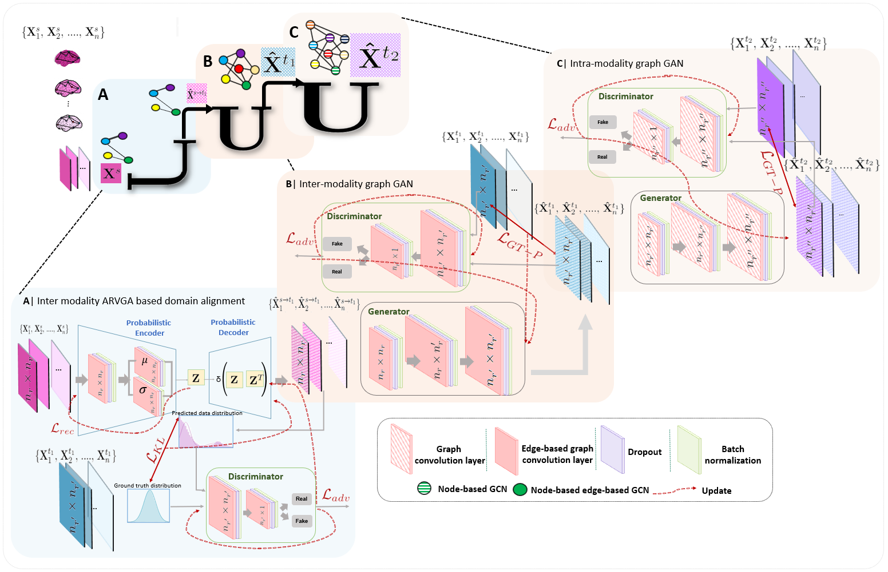
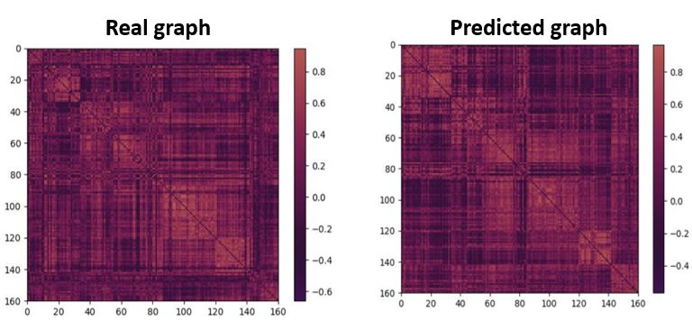

# StairwayGraphNet
 StairwayGraphNet (StairwayGraphNet for Inter- and Intra-modality Multi-resolution Brain Graph Alignment and Synthesis), coded up in Python by Islem Mhiri. Please contact islemmhiri1993@gmail.com for inquiries. Thanks.

This repository provides the official PyTorch implementation of the following paper:

<p align="center">
  
</p>

> **StairwayGraphNet for Inter- and Intra-modality Multi-resolution Brain Graph Alignment and Synthesis**
> [Islem Mhiri]<sup>1,2</sup>, [Mohamed Ali Mahjoub]<sup>2</sup>, [Islem Rekik]<sup>1</sup>(https://basira-lab.com/)

> <sup>1</sup>BASIRA Lab, Faculty of Computer and Informatics, Istanbul Technical University, Istanbul, Turkey

> <sup>2</sup>  Laboratory of Advanced Technology and Intelligent Systems, National Engineering School of Sousse, Tunisia

> **Abstract:**  Synthesizing multimodality medical data provides complementary knowledge and helps doctors make precise clinical decisions. Although promising, existing multimodal brain graph synthesis frameworks have several limitations. First, they mainly tackle only one problem (intra- or inter-modality), limiting their generalizability to synthesizing inter- and intra-modality simultaneously. Second, while few techniques work on super-resolving low-resolution brain graphs within a single modality (i.e., intra), inter-modality graph super-resolution remains unexplored though this would avoid the need for costly data collection and processing. More importantly, both target and source domains might have different distributions, which causes a domain fracture between them. To fill these gaps, we propose a multi-resolution StairwayGraphNet (SG-Net) framework to jointly infer a target graph modality based on a given modality and super-resolve brain graphs in both inter and intra domains. Our SG-Net is grounded in three main contributions: (i) predicting a target graph from a source one based on a novel graph generative adversarial network in both inter (e.g., morphologicalfunctional) and intra (e.g., functional-functional) domains, (ii) generating highresolution brain graphs without resorting to the time consuming and expensive MRI processing steps, and (iii) enforcing the source distribution to match that of the ground truth graphs using an inter-modality aligner to relax the loss function to optimize. Moreover, we design a new Ground Truth-Preserving loss function to guide both generators in learning the topological structure of ground truth brain graphs more accurately. Our comprehensive experiments on predicting target brain graphs from source graphs using a multi-resolution stairway showed the outperformance of our method in comparison with its variants and state-of-the-art method. SG-Net presents the first work for graph alignment and synthesis across varying modalities and resolutions, which handles graph size, distribution, and structure variations. 

# Installation

The code has been tested with Python 3, PyTorch 1.3.1 on Ubuntu 16.04. GPU is required to run the code. You also need other dependencies (e.g., numpy, networkx) which can be installed via: 

```bash
pip install -r requirements.txt
```

# Training and testing StairwayGraphNet

We provide a demo code for the usage of StairwayGraphNet for a target graph prediction from a source graph. 

To evaluate our framework, we used 3 fold-cross-validation strategy.

You can train the program with the following command:

```bash
python main.py 
```

**Input data**

In order to use our framework, you need to provide:

* a source matrix of size (m × f). We denote m the total number of subjects in the dataset and f the number of features. 

* a target 1 matrix of size (m × f1 ). We denote m the total number of subjects in the dataset and f1 the number of features. 

* a target 2 matrix of size (m × f2 ). We denote m the total number of subjects in the dataset and f2 the number of features. 

* You need to include your data in the file main.py. So, just remove our simulated dataset and replace it with yours.

**Output Data**

* a predicted tensor of size (m × n2 × n2) stacking the predicted 2 brain graphs where m is the number of subjects and n2 is the number of regions of interest.

* a target tensor size (m × n2 × n2 ) stacking the target 2 brain graphs where m is the number of subjects and n2 is the number of regions of interest.

* a predicted tensor of size (m × n1 × n1) stacking the predicted 1 brain graphs where m is the number of subjects and n1 is the number of regions of interest.

* a target tensor size (m × n1× n1 ) stacking the target 1 brain graphs where m is the number of subjects and n1 is the number of regions of interest.

* a source tensor of size (m × n × n ) stacking the source brain graphs where m is the number of subjects and n is the number of regions of interest

# Example Results
In this example, we simulated a dataset with 150 samples where the number of regions of interest in the source domain = 35, the number of regions of interest in the target domain = 160 and the number of regions of interest in the target domain = 268 using 3 fold-CV. 

<p align="center">
  
</p>


# YouTube video presentation of StairwayGraphNet: 

https://www.youtube.com/watch?v=EkXcReAeGdM&ab_channel=BASIRALab

# Paper link:

https://link.springer.com/chapter/10.1007/978-3-030-87589-3_15

# StairwayGraphNet on arXiv

https://arxiv.org/abs/2110.04279

# Please cite the following paper when using StairwayGraphNet:

```latex
@InProceedings{Mhiri2021StairwayGraphnet,
author="Mhiri, Islem and Mahjoub, Mohamed Ali and Rekik, Islem",
editor="Lian, Chunfeng and Cao, Xiaohuan and Rekik, Islem and Xu, Xuanang and Yan, Pingkun",
title="StairwayGraphNet for Inter- and Intra-modality Multi-resolution Brain Graph Alignment and Synthesis",
booktitle="Machine Learning in Medical Imaging",
year="2021",
publisher="Springer International Publishing",
pages="140--150",
}
```

# License
Our code is released under MIT License (see LICENSE file for details).

# Contributing
We always welcome contributions to help improve StairwayGraphNet and evaluate our framework on other types of graph data. If you would like to contribute, please contact islemmhiri1993@gmail.com. Many thanks.


